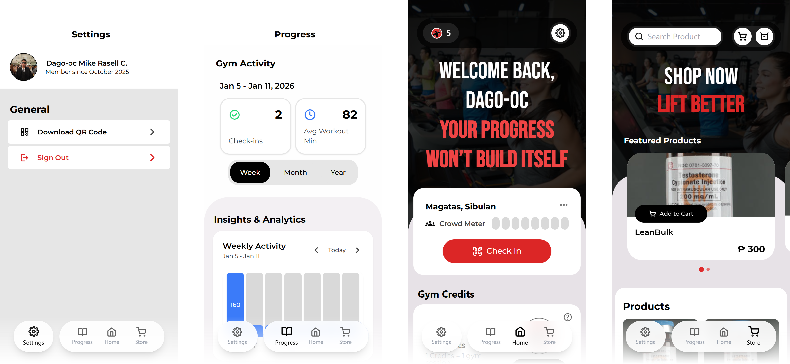
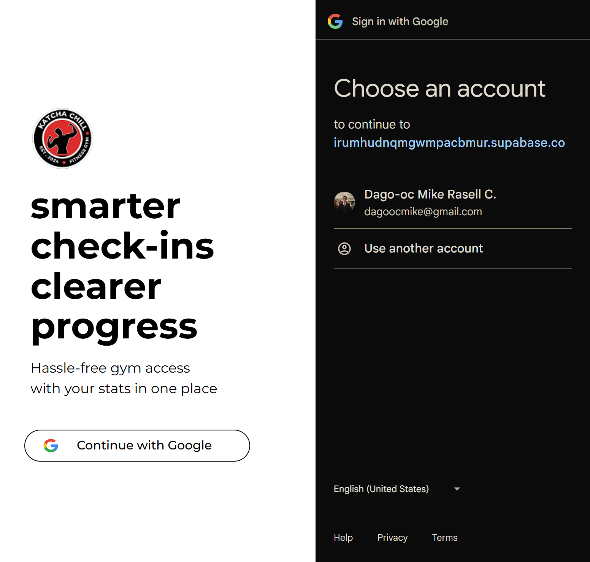
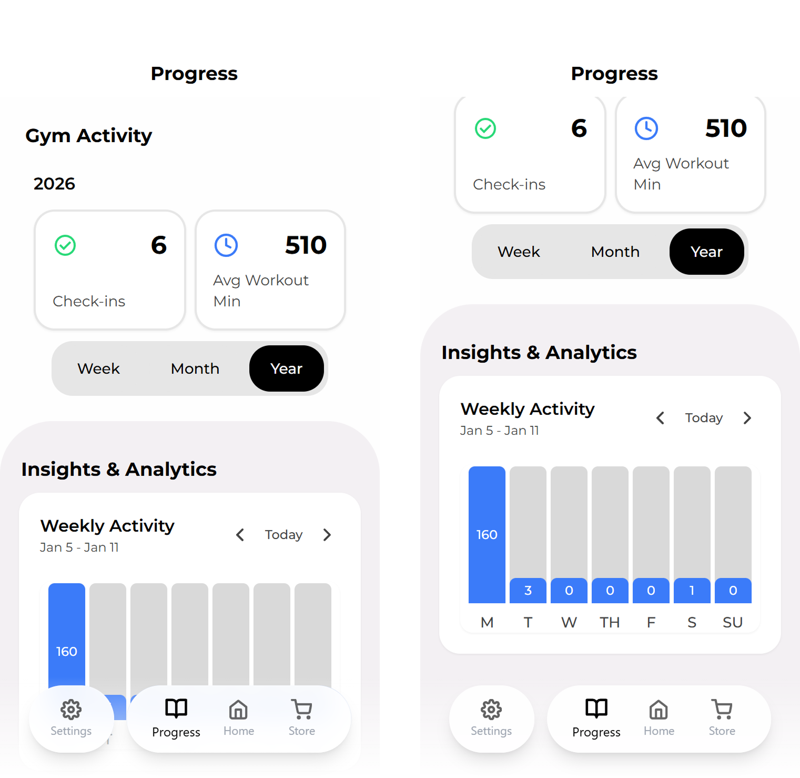
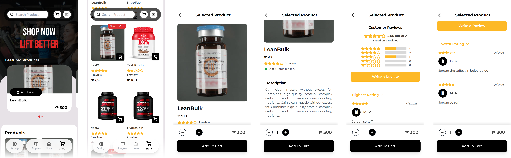

# Katcha Chill and Fitness App

## Description
Katcha Chill Fitness App is a mobile gym management application developed for a local gym client as part of a university project.

The system was designed to modernize gym operations by replacing manual attendance tracking and package management with a real-time mobile platform. Features include real-time crowd monitoring with gym traffic insights, QR and credit-based check-ins, an integrated store, personal gym usage analytics, and Google OAuth authentication for secure login.

> Status: Active Development

## Features
### User Authentication

- Google OAuth integration using Supabase Auth
- Secure login, session persistence, and protected routes

### Crowd Monitoring

- Gym crowd monitoring and active member tracking
- Weekly crowd history tracking with data visualization
- Hourly gym population breakdown per day

### Personal Analytics

- Personal gym usage insights and attendance history (workout duration and check-in tracking)
- Weekly, monthly, and yearly analytics
- Daily activity minute breakdown with historical data navigation

### Credit System

- Credit-based gym access management
- Credit package browsing and purchase system
- Realtime notifications for purchase approval and validation

### Check-In System

- QR-based gym check-in authentication
- One-tap manual check-out workflow
- Automatic credit deduction per gym session
- Staff-validated attendance and session tracking

### Store System

- In-app gym merchandise and supplements store
- Product browsing with pricing, descriptions, and stock visibility
- Shopping cart and checkout management system
- Purchase history support

### Product Reviews

- Product reviews with star ratings and comments
- Review submission restricted to verified purchasers
- One review per user per product limitation
- Profanity filtering and content moderation system

### UI / UX

- Modular and reusable component architecture
- Centralized error handling and feedback modal system
- Optimized navigation and smooth user interaction flow

## Tech Stack
### Frontend
- React
- TypeScript
- Tailwind CSS
- Vite
- Framer Motion
  
### Backend / BaaS
- Supabase
  - Google OAuth Authentication
  - PostgreSQL Database
  - PostgreSQL Functions & Triggers
  - Row-Level Security (RLS)
  - Realtime Subscriptions
  - Storage Buckets

### Design
- Figma

### Deployment
- Netlify

## Screenshots
### Login UI Flow

### Main UI Screens

### Gym Progress Screen

### Credit Packages Screen

### Crowd Details Screen

### Add Credits UI Flow

### Check-In UI Flow

### Shop and Add to Cart Screens

### Product Review UI Flow

### Add to Cart UI Flow

### Check Out UI Flow

## Installation

## License
This project is intended for educational and portfolio purposes.
